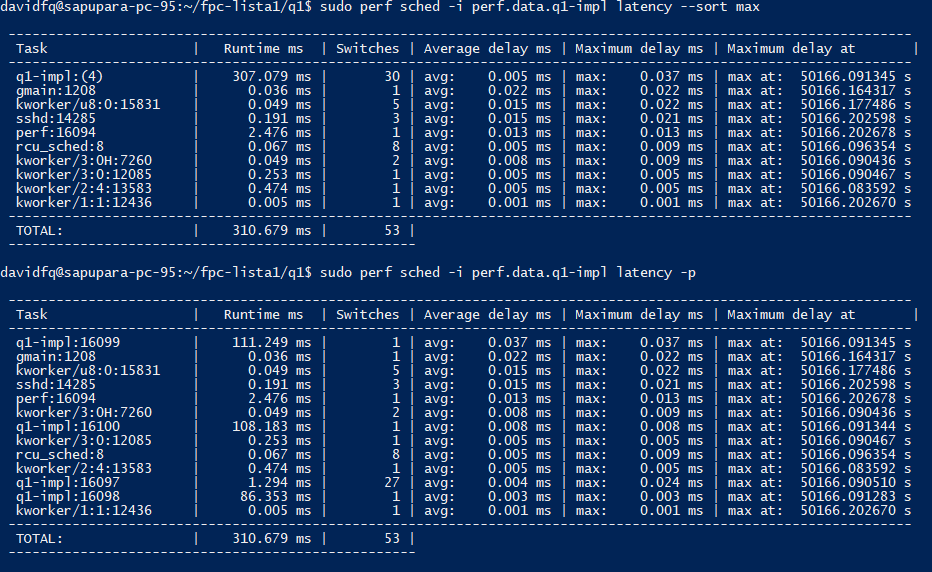
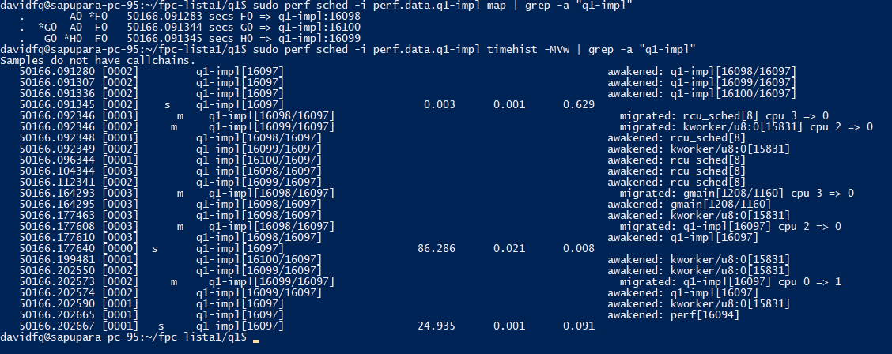
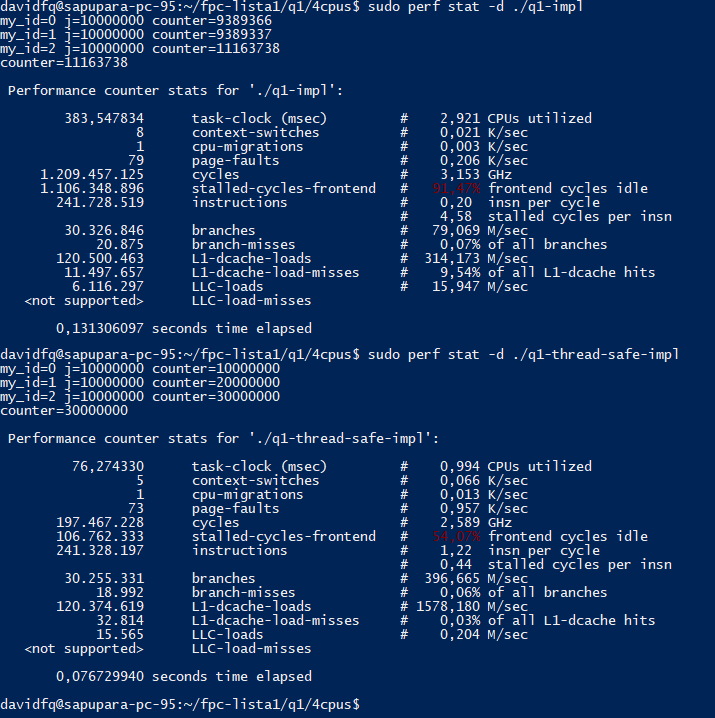
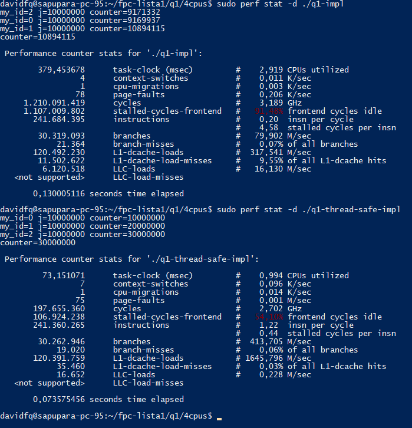
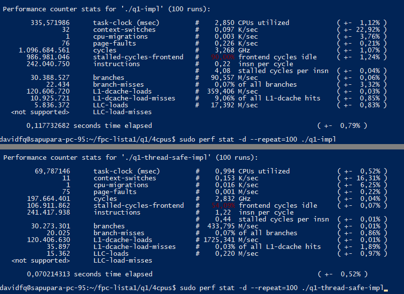
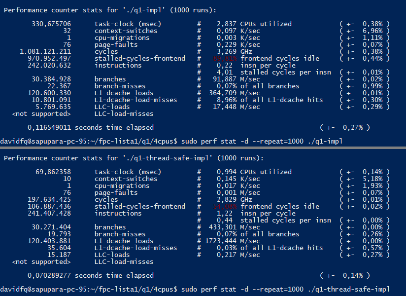

# Perf Analysis

```bash
sudo perf sched -i perf.data latency --sort max
sudo perf sched -i perf.data latency -p
```



```bash
sudo perf sched -i perf.data map
sudo perf sched -i perf.data timehist -MVw
```



```bash
sudo perf stat -d executavel
sudo perf stat -d --repeat=100 executavel
sudo perf stat -d --repeat=1000 executavel
```





## Outros comandos
```bash
sudo perf record executavel
sudo perf script -i perf.data
```
