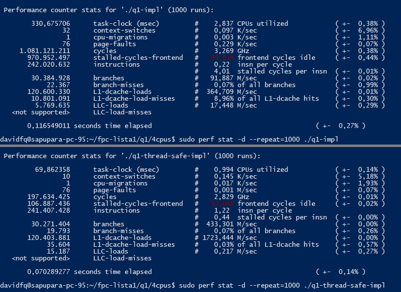

# Questão 1:

## Análise de desempenho
Antes de explicar, precisamos primeiro "batizar" as implementações. Chamaremos de Vanila a implementação que não protege as regiões críticas e de Thread-safe a implementação alternativa. Feito isso, constatamos que a implementação Threadsafe tem melhor desempenho que a Vanila. Esse desempenho chega a ser 5 vezes melhor, ou seja, o tempo de execução do Vanila pode ser até 5 vezes maior que o Thread-safe. 

Para a análise, executamos os programas até 1000 vezes cada. Fizemos isso utilizando o programa Perf do linux, utilizando especificamente o comando sudo perf stat -d --repeat=numero executavel. Também observamos outras métricas disponibilizadas pelo perf, mas como são mais densas em termos informativos, vamos nos manter nos resultados do perf stat (que já é suficiente). Ainda assim, todos os dados coletados estão salvos no [diretório perf-analysis](https://github.com/dfquaresma/fpc/lista1/q1/perf-analysis).

A explicação para a diferença de desempenho pode ser justificada pela diferença no número de trocas de contexto, conforme constatado na imagem referente ao output do perf stat. Além disso, também é possível notar que na execução do código Vanila há muitos LLC-Loads e L1-dcache-load-misses se comparado aos resultados da execução do código Thread-safe. Acreditamos que a justificativa para que menos trocas de contexto aconteçam na execução do código Thread-safe se dê pelo fato de quê as threads concorrentes ficam bloqueadas até que a thread de posse do mutex libere o lock, enquanto na execução Vanila todas as thread competem pela CPU sem controle algum.



## Comando para Compilar
```bash
gcc -o q1-impl q1-impl.c  -pthread
gcc -o q1-thread-safe-impl q1-thread-safe-impl.c  -pthread
```

## Comando para executar
```bash
./q1-impl
./q1-thread-safe-impl
```

## Comandos Perf usados
```bash
sudo perf record executavel
sudo perf script -i perf.data
sudo perf stat -d executavel
sudo perf stat -d --repeat=numero executavel
sudo perf sched -i perf.data latency --sort max
sudo perf sched -i perf.data latency -p
sudo perf sched -i perf.data map
sudo perf sched -i perf.data timehist -MVw
```
